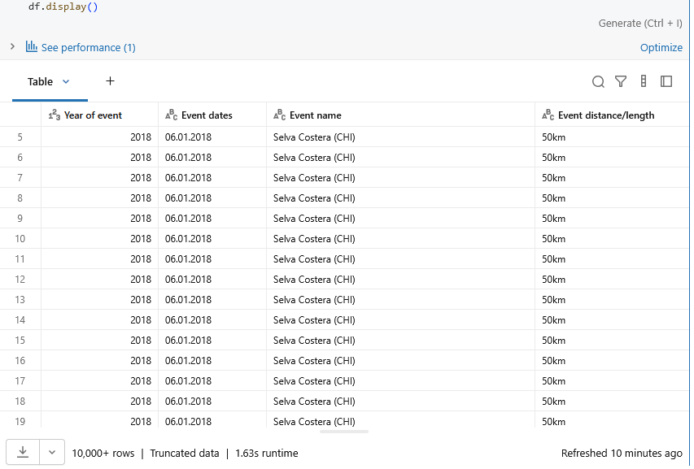

# lab_marathos_data_lab

Everything is in "marathos_robin_a" folder

##Setup Instructions
- Run catalogue_builder notebook in transformations folder
- Import data (linked below) into marathos/default/raw/data volume directory
- Run eda notebook and rest of scripts

Kaggle data used: [The big dataset of ultra-marathon running](https://www.kaggle.com/datasets/aiaiaidavid/the-big-dataset-of-ultra-marathon-running/data)
(CSV-file)

Screenshot of data imported correctly:
